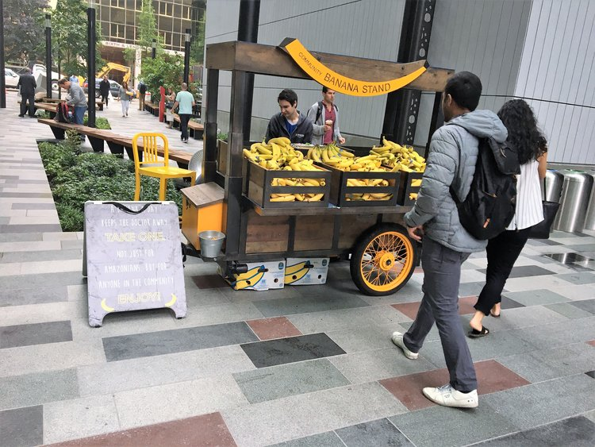
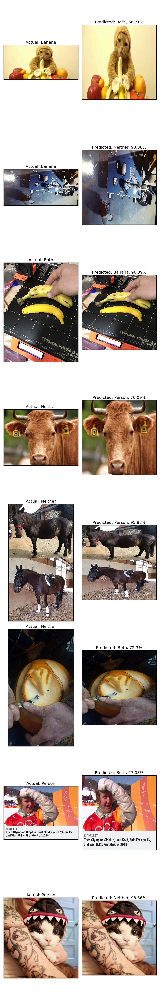

# Banana, Person, or Neither?
Project for Galvanize Data Science Immersive

by Julia Chapman

# Overview
Data Source: Scraped from certain subreddits and google images using:

[Reddit Fetch](https://github.com/nobodyme/reddit-fetch)

[Google Images Download](https://github.com/hardikvasa/google-images-download)

In 2005, an internet meme was started when a woman, trying to sell a TV, put a banana in her sale ad as a unit of measurement. Since then, ['Banana For Scale'](https://knowyourmeme.com/memes/banana-for-scale) has grown in popularity and has been dubbed the ['yardstick of the internet.'](https://www.dailydot.com/unclick/banana-for-scale-meme-history/)

"Banana for Scale" has also been adapted to other objects. In this case, a double mattress!

So this got me thinking, what if you could use a banana as an actual unit for scale in an image?

Unfortunately, you'll have to wait for Capstone 3 to find out.

In the meantime, I set out to create a model that could predict if an image contained a banana, a person, both, or neither.

# Data

After scraping Reddit and Google for images, I had about 1,100 images total. Three of the classes were close to balanced, with 'Both' having double the images of the others. I accounted for this imbalance by calulating sample weights to use in the fitting of my models. I split my data into training, validation, and holdout datasets with splits of 0.65/0.15/0.20 respectively.

Mean Img Size: 1132 X 1243

Stdev: 1043 X 1043

My images varied quit a lot and had a lot of noise.

# Model

I first started off with a simple CNN. My final simple model used a pattern of Convolution2D and MaxPooling2D layers three times. After those six layers, the model was flattened into a dense layer with a final dense layer with n_categories nodes. There were also dropouts between each layer to help reduce overfitting. The pool size was (2,2) and there were 128 filters in each convolution with the input image size as (300,300). The learning rate was 0.00001.

Holdout Loss: 

Holdout Accuracy: 

My simple CNN didn't perform very well because I have a very limited set of data with a lot of noise. To help it better learn the features, a few orders of magnitude greater of data would be optimal.

Because of my limited data set, I next took advantage of transfer learning to help my model along. Transfer learning boosts small datasets by loading in initial weights and layers pretraining on large datasets. With the more generalized features, the transfer learning was able to give my model prior information to initiate with.

I used the keras Xception model trained on ImageNet as my initial model. 

To use the Xception model, I removed the head and added a layer of my own. I added a GlobalAveragePooling2D layer with a Dense layer with n_categories nodes for output.
To retrain the Xception model, I first started with 5 warmup epochs on just the new head (lr=0.0006)
After the warmup, I unfroze the next 6 layers and continued to train (lr=0.00001) until the loss_validation didn't have a significant change.

# Results

**Final Model**

Holdout Loss:

Holdout Accuracy:

My final transfer learning model had a precision of !!!!!!!!!!!!!!!!!!!!!

# Future Work

Next, I plan to add to my current structure to change it from a classification prediction to a regression prediction model. Then, I will train it on image data with corresponding dimensions of bananas and people in the image.

